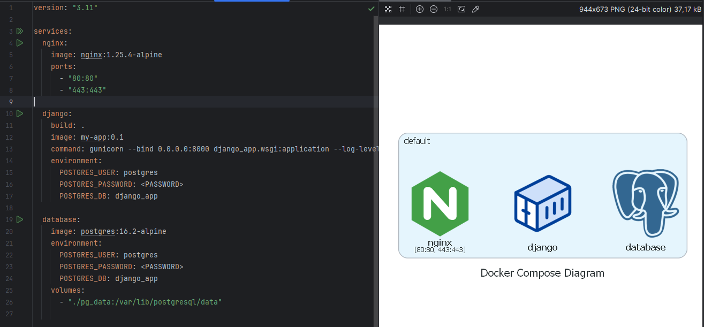
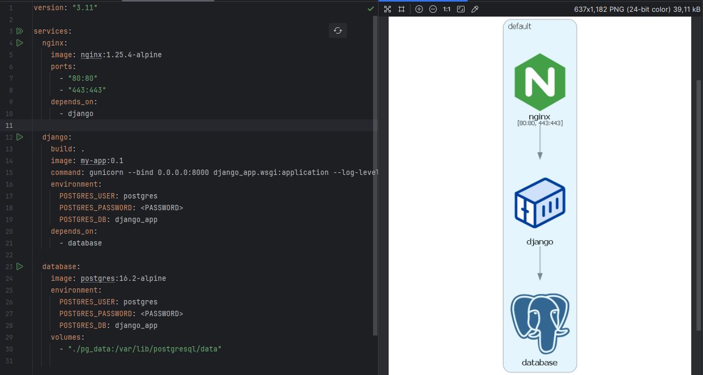
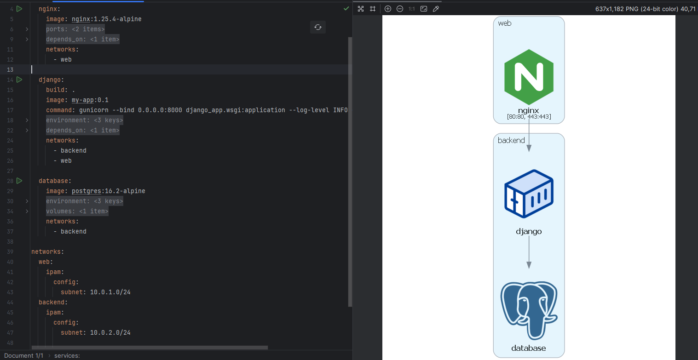
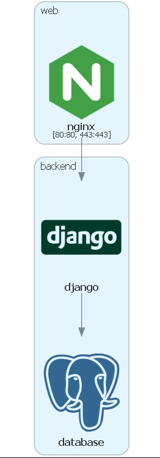
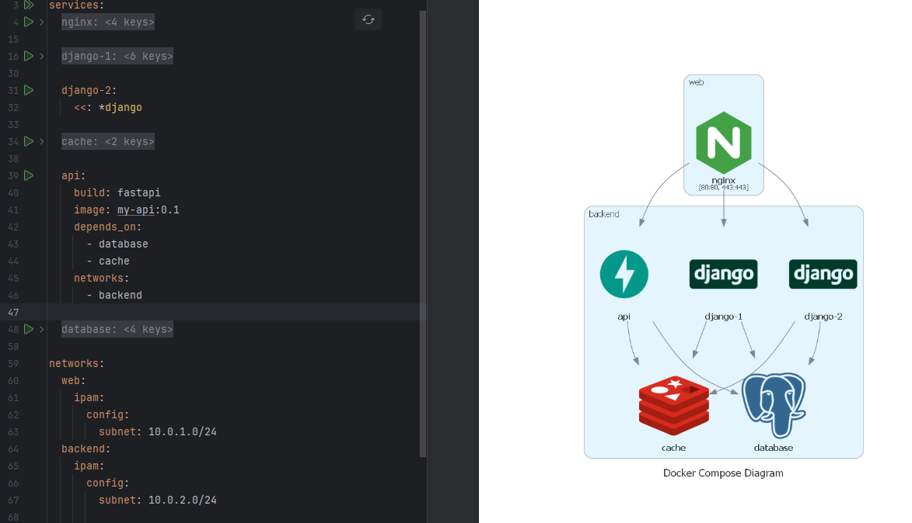

## Auto Diagrams

Создает диаграмму из сервисов docker-compose.yaml

Картинка создается рядом с указанным файлом `docker-compose` и называется так же,
но формат `.png`


### Простой пример

```shell
python draw_diag.py compose-examples/django-app.yaml
```




### Добавим связи

Через указание `depends_on` либо `links`

```shell
python draw_diag.py compose-examples/django-app-links.yaml
```




### Добавим подсети

```shell
python draw_diag.py compose-examples/django-app-networks.yaml
```



### Укажем псевдоним для образа контейнера

Иконки для сервисов определяются через названия образов контейнера.

Допустим - `image: nginx` отобразит иконку для nginx.

Чтобы настроить иконку для своего сервиса, надо задать псевдоним для образа контейнера: `my-app=django`

```shell
python draw_diag.py compose-examples/django-app-networks.yaml my-app=django
```




### Вариант с несколькими django контейнерами

```shell
python draw_diag.py compose-examples/django-app-multi.yaml my-app=django my-api=fastapi
```

